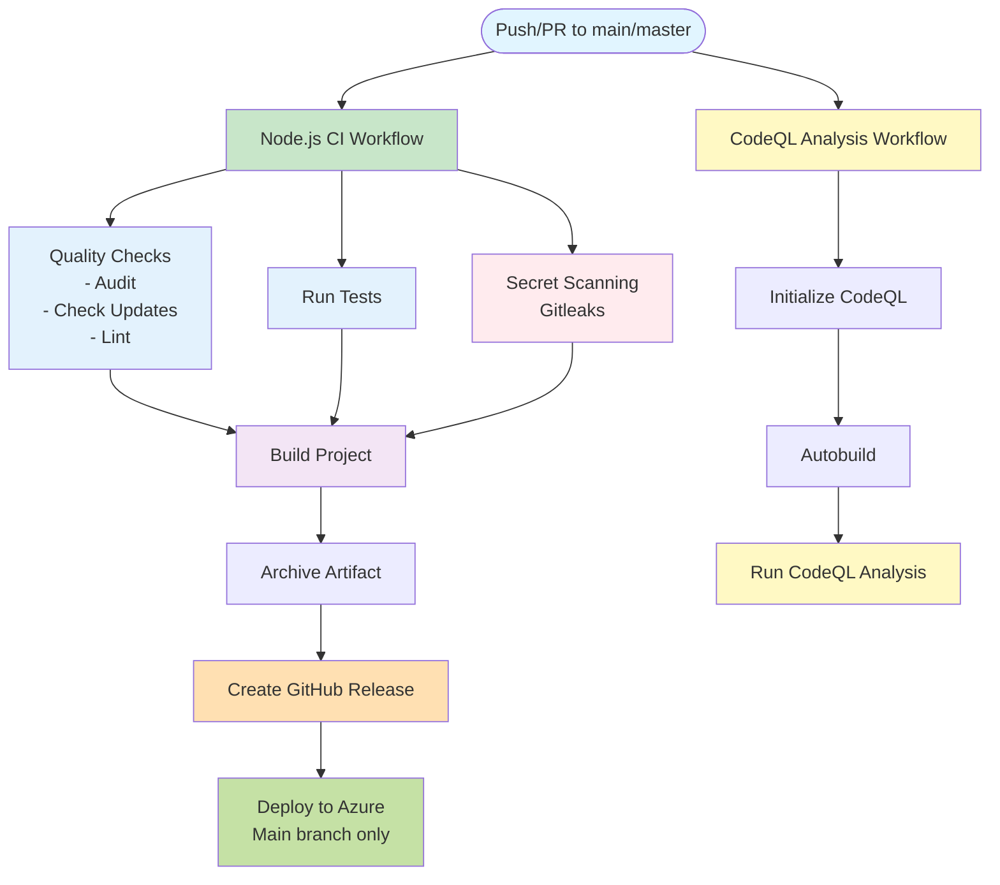

# Vanilla JavaScript SPA - Wiki

Welcome to the Vanilla JavaScript Single Page Application (SPA) project wiki!

## Overview

This is a simple, lightweight Single Page Application built with vanilla JavaScript, HTML, and CSS. The project demonstrates modern web development practices using Webpack for bundling and Sass for styling, without relying on heavy frameworks.

## Table of Contents

- [Getting Started](#getting-started)
- [Project Structure](#project-structure)
- [Development](#development)
- [Building for Production](#building-for-production)
- [Testing](#testing)
- [CI/CD](#cicd)
- [Architecture](#architecture)
- [Contributing](#contributing)

## Getting Started

### Prerequisites

- Node.js 20 or higher
- npm (comes with Node.js)

### Installation

1. Clone the repository:
   ```bash
   git clone <repository-url>
   cd javascript-spa-simple
   ```

2. Install dependencies:
   ```bash
   npm install
   ```

3. Start the development server:
   ```bash
   npm start
   ```

   The application will open automatically in your browser at `http://localhost:8080` (or the next available port).

## Project Structure

```
javascript-spa-simple/
├── src/
│   ├── controllers/          # Page controllers
│   │   ├── 404.controller.js
│   │   ├── home.controller.js
│   │   ├── posts.controller.js
│   │   └── index.js
│   ├── router/               # Routing logic
│   │   └── index.routes.js
│   ├── sass/                 # Stylesheets
│   │   └── main.scss
│   ├── view/                 # HTML templates
│   │   ├── 404.html
│   │   ├── home.html
│   │   └── posts.html
│   ├── index.html            # Main HTML entry point
│   └── main.js               # Application entry point
├── webpack/                  # Webpack configuration
│   ├── webpack.config.cjs
│   ├── webpack.config.dev.cjs
│   └── webpack.config.prod.cjs
├── test/                     # Test files
│   └── example.test.js
└── package.json
```

## Development

### Available Scripts

- `npm start` - Start the development server with hot reload
- `npm run build` - Build the project for production
- `npm run clean` - Remove the dist directory
- `npm run lint` - Run ESLint to check code quality
- `npm run lint:fix` - Run ESLint and automatically fix issues
- `npm test` - Run tests
- `npm run audit` - Run security audit
- `npm run audit:fix` - Fix security vulnerabilities
- `npm run check-updates` - Check for available dependency updates
- `npm run upgrade-deps` - Upgrade dependencies to latest versions

### Development Workflow

1. Make your changes in the `src/` directory
2. The development server will automatically reload when you save files
3. Check the browser console for any errors
4. Run linting and tests before committing:
   ```bash
   npm run lint
   npm test
   ```

## Building for Production

To create a production build:

```bash
npm run build
```

The production build will be output to `webpack/dist/` directory, containing:
- `bundle.js` - Minified JavaScript bundle
- `main.css` - Compiled and minified CSS
- `index.html` - Optimized HTML file

## Testing

The project uses Node.js built-in test runner. Run tests with:

```bash
npm test
```

Tests are located in the `test/` directory and follow the pattern `*.test.js`.

## CI/CD

The project includes GitHub Actions workflows for:

### Pipeline Overview



### Node.js CI (`nodejs-ci.yml`)
- Runs on pushes and pull requests to `main`/`master` branches
- Installs dependencies
- Runs security audits
- Checks for dependency updates
- Lints code
- Scans for secrets using Gitleaks
- Builds the project
- Runs tests
- Creates GitHub releases with build artifacts
- Deploys to Azure (main branch only)

### CodeQL Analysis (`codeql-analysis.yml`)
- Performs security analysis using CodeQL
- Runs on push, pull requests, and weekly schedule
- Analyzes JavaScript code for security vulnerabilities


## Architecture

### Routing

The application uses hash-based routing (`#/`). The router is defined in `src/router/index.routes.js` and handles:
- `#/` - Home page
- `#/posts` - Posts page
- Any other route - 404 page

### Controllers

Controllers are responsible for rendering page content. Each controller:
- Loads the corresponding HTML template
- Can fetch data if needed (e.g., posts)
- Returns a DOM element to be inserted into the root container

### Styling

- **Bootstrap 5.3.8** - For base UI components and grid system
- **Sass** - For custom styling and theming
- Styles are compiled and bundled by Webpack

### Build System

**Webpack 5** is used for:
- Bundling JavaScript modules
- Processing Sass files
- Optimizing assets for production
- Development server with hot module replacement

## Contributing

1. Fork the repository
2. Create a feature branch (`git checkout -b feature/amazing-feature`)
3. Make your changes
4. Run linting and tests:
   ```bash
   npm run lint
   npm test
   ```
5. Commit your changes (`git commit -m 'Add some amazing feature'`)
6. Push to the branch (`git push origin feature/amazing-feature`)
7. Open a Pull Request

### Code Style

- Follow ESLint rules (run `npm run lint` to check)
- Use meaningful variable and function names
- Add comments for complex logic
- Keep functions small and focused

## Troubleshooting

### Port Already in Use

If port 8080 is already in use, Webpack Dev Server will automatically try the next available port. Check the terminal output for the actual URL.

### Build Errors

1. Make sure all dependencies are installed: `npm install`
2. Clear node_modules and reinstall if needed:
   ```bash
   rm -rf node_modules package-lock.json
   npm install
   ```
3. Check Node.js version matches the requirement (Node 20)

### Module Not Found Errors

- Ensure you're using ES6 import/export syntax
- Check file paths are correct (case-sensitive)
- Verify the file exists in the expected location

## License

ISC

## Support

For issues, questions, or contributions, please open an issue or pull request on GitHub.

